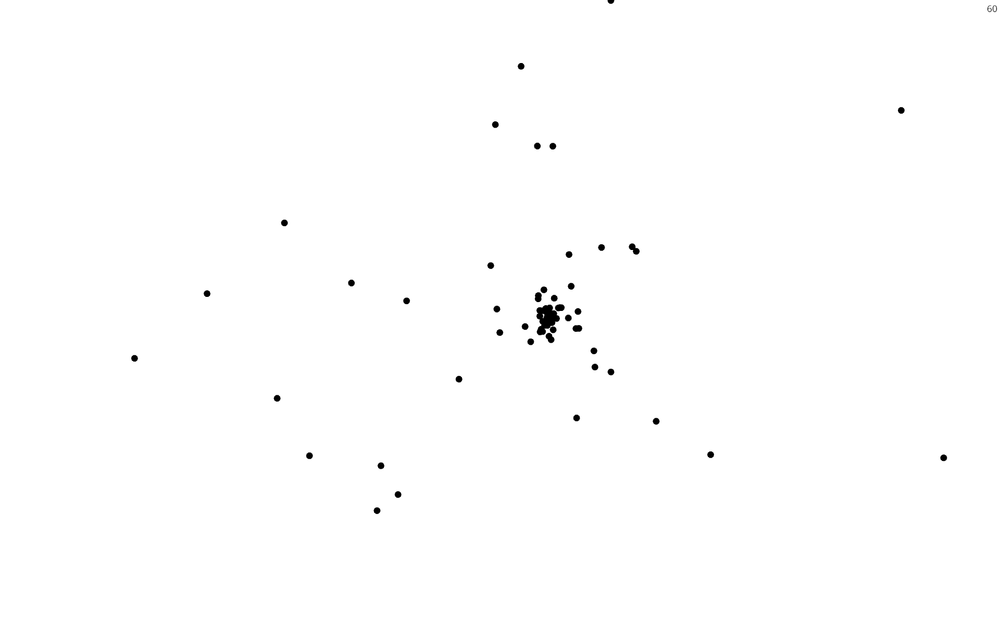
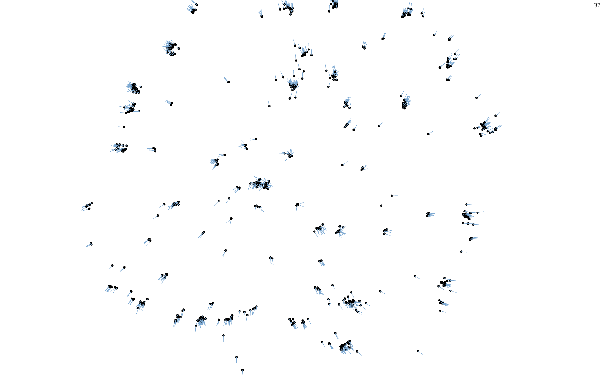
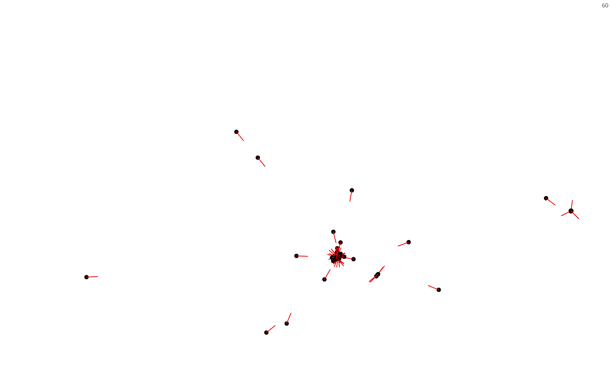
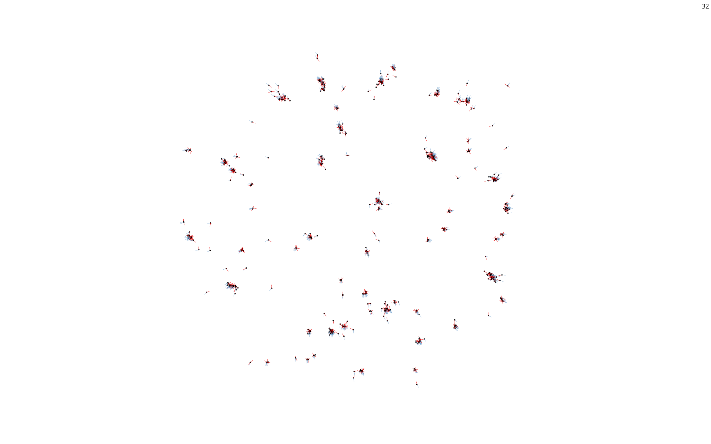
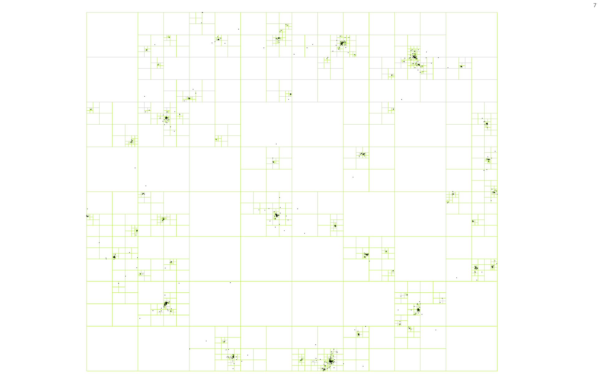

# gravity

n-body gravity simulator


### Running
Execute
```
cargo run --release
```

### Control
Click and drag the mouse to view around, use your mousewheel to zoom in and out.

Press ```f``` to toggle following the particle that is most central to your viewpoint right now.


Press ```v``` to toggle velocity indicators for each particle.


Press ```a``` to toggle acceleration indicators for each particle.




Press ```t``` to toggle visualization of the Barnes-Hut tree that is used for approximate force calculations.


Press ```Space``` to freeze and unfreeze the simulation.
